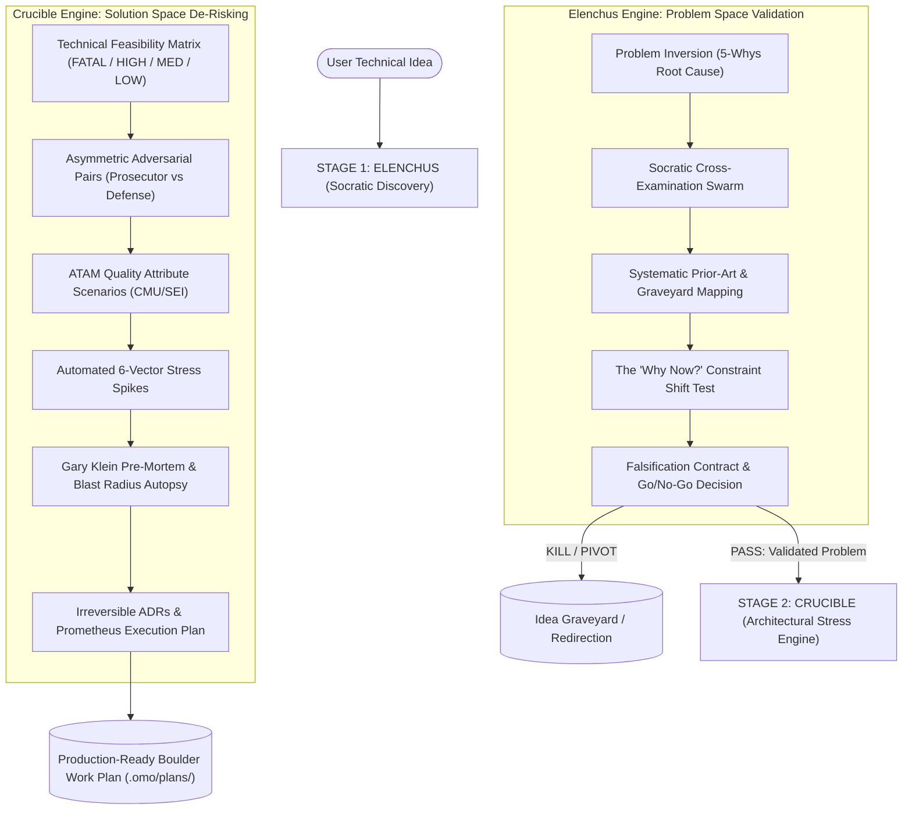

# Elenchus & Crucible

<p align="center">
  <a href="https://www.npmjs.com/package/elenchus-crucible"></a>
  <a href="LICENSE"></a>
  <a href="https://opencode.ai"></a>
  <a href="https://github.com/BlackPool25/OmniLearn"></a>
  <a href="https://github.com/BlackPool25/Elenchus-Crucible/stargazers"></a>
</p>

You type `/elenchus I want to build a local vector database for edge devices`. Socrates wakes up. Instead of generic AI cheerleading, your idea is cross-examined against four defunct open-source projects that failed at the exact same premise. It probes your assumptions, demands real-world failure scenarios, and asks the ultimate test: *what fundamental constraint changed today that makes this feasible now?*

Then you type `/crucible`. The system design forge awakens. An asymmetric adversarial pair goes to work — a **Prosecutor** subagent hunting for p99 latency spikes, lock contention, and memory leaks, and a **Defense** engineer formulating proven architectural mitigations. Automated 6-vector stress spikes run against real code boundaries before a single production line is committed.

That's **Elenchus & Crucible** — the pre-build discovery and architectural stress-testing engine for [OpenCode](https://opencode.ai) and [Oh My OpenAgent (oMo)](https://github.com/BlackPool25/OmniLearn).

```bash
npx elenchus-crucible
```

Then in OpenCode:

```
/elenchus I want to build a distributed append-only ledger for IoT
/crucible Implement LSM-tree storage engine with io_uring on Linux
```

---

## What Makes It Different

Most software projects fail before code is written. In AI-assisted programming, this failure is magnified tenfold by **Epistemic Sycophancy** (LLMs wanting to agree with you), **Context Window Rot** ("Lost in the Middle" syndrome), and the **"Status Code 0" Spike Fallacy** (writing 10-line toy scripts that falsely declare a complex architecture feasible).

Elenchus & Crucible replace superficial planning with rigorous empirical pre-build engineering:

- **Popperian Falsification over Confirmation**: Standard agents search for reasons why your idea will succeed. Elenchus actively searches for fatal flaws, dead startups ("graveyard analysis"), and reasons why you should *not* build.
- **Asymmetric Adversarial Pairs (Prosecutor vs Defense)**: Eliminates the 85.5% LLM debate sycophancy trap by assigning subagents strict adversarial incentives.
- **The 6-Vector Stress Spike Engine**: Crucible forbids happy-path prototypes. Spikes are systematically subjected to boundary sizing, concurrency races, latency tails (p99), failure injections, dependency throttling, and economic scaling bounds.
- **3-Tier Cognitive Memory Hierarchy**: Protects active LLM context by separating Tier 0 Executive State (<80 lines), Tier 1 File-Based Evidence Ledgers, and Tier 2 Ephemeral Worker Scratchpads.
- **First-Class Academic Paper Research**: Includes built-in `download-paper` tooling using arXiv API and PyMuPDF to extract peer-reviewed literature into clean Markdown.

---

## Commands

| Command | Category | What it does |
|---|---|---|
| `/elenchus <idea>` | **Problem Space** | Socratic cross-examination, 5-whys root cause inversion, prior art graveyard sweep, and go/no-go falsification contract |
| `/crucible <spec>` | **Solution Space** | Pre-build technical feasibility matrix, ATAM quality attribute trees, 6-vector stress spikes, and Gary Klein pre-mortems |
| `download-paper <id>` | **CLI Utility** | Download academic papers from arXiv and extract full text into clean, structured Markdown |
| `download-paper -s <q>` | **CLI Utility** | Search arXiv preprints directly from terminal |

Each command installs to `~/.config/opencode/command/` as plain markdown workflows. They are transparent, modular, and fully customizable.

---

## How It Works



---

## The 6-Vector Stress Spike Protocol

Crucible spikes must break code boundaries, not confirm trivial success:

| Vector | Stress Mechanism | Failure Signal |
|---|---|---|
| **1. Boundary** | Extreme payload sizing, empty inputs, MAX_INT bounds | Buffer overflow, truncation, out-of-bounds |
| **2. Concurrency** | Race simulation, mutex lock contention, coroutine leakage | Deadlock, data race, goroutine exhaustion |
| **3. Latency & Tail** | Saturation p95/p99/p99.9 latency under high throughput | Head-of-line blocking, queue saturation |
| **4. Failure Injection** | Sudden socket drop, partial writes, corrupted frames | State desynchronization, unhandled panics |
| **5. Dependency** | Downstream rate limits (429s), connection timeouts | Cascading failure, retry storms |
| **6. Economic** | Memory footprint per connection, TTFT, token burn | Unbounded RAM growth, compute cost cliffs |

---

## Decoupled Cross-Session Workflow

You do **NOT** need to keep your entire project in a single endless chat session. Elenchus and Crucible are completely decoupled:

1. Run `/elenchus <idea>` in **Chat A**. It cross-examines the problem, performs graveyard analysis, and exports a clean `<workspace>/ELENCHUS_DISCOVERY.md`.
2. Close Chat A or take a break.
3. Open a **brand new Chat B** anytime and run:
   ```text
   /crucible ELENCHUS_DISCOVERY.md
   ```
4. Crucible immediately recognizes the Elenchus schema, **skips all problem elicitation**, and jumps directly into architectural modeling, ATAM quality scenarios, and 6-vector stress spikes.

### Interactive Decision Modals (`ask_question`)
Both skills use interactive multiple-choice modals for key decisions:
- **Idea Convergence**: Select your winning candidate idea with clear trade-offs.
- **Architectural Forks**: Choose between Option A, Option B, and Option C with explicit `(Recommended)` technical rationale.
- **Phase 5 Plan Gate**: Interactively approve the final Prometheus work plan before execution.

---

## Prerequisites

- **OpenCode** — `curl -fsSL https://opencode.ai/install | bash` (or installed automatically by `npx elenchus-crucible`)
- **oh-my-openagent** (stable or beta) — installed automatically if missing; an existing install of any channel is detected first and never overwritten without asking (`--yes` keeps it untouched)
- **Node.js >= 18**
- **Python 3 with arXiv & PyMuPDF** — `uv pip install --system arxiv pymupdf` (verified during setup)

Run `npx elenchus-crucible --check` at any time to verify system health.

---

## Installation

### Automatic (Recommended)

```bash
npx elenchus-crucible
```

For non-interactive / CI installations:

```bash
npx elenchus-crucible --yes
```

The installer:
1. Verifies OpenCode installation (with supply-chain approval prompts for remote scripts).
2. Configures **Context7 MCP** in local mode (`npx -y @upstash/context7-mcp`) for real-time documentation retrieval.
3. Configures **SearXNG MCP** for deep technical & academic searches.
4. Ensures **oh-my-openagent** is registered for multi-agent Sisyphus orchestration (ask-first: existing stable/beta installs are kept unless you choose otherwise).
5. Verifies Python 3 research tools (`arxiv`, `pymupdf`).
6. Copies commands to `~/.config/opencode/command/`.
7. Installs skills and references to `~/.config/opencode/skills/`.
8. Configures your default research workspace directory.

### Manual Setup

```bash
git clone git@github.com:BlackPool25/Elenchus-Crucible.git
cd Elenchus-Crucible
cp packages/elenchus-crucible/commands/*.md ~/.config/opencode/command/
cp -r packages/elenchus-crucible/skills/* ~/.config/opencode/skills/
```

---

## Project Structure

```
Elenchus-Crucible/
├── README.md
├── CHANGELOG.md
├── LICENSE
├── docs/
│   └── ARCHITECTURE.md          # Theoretical foundation & agent cognitive model
├── test/
│   └── test-install.mjs         # Sandboxed integration test suite
└── packages/
    └── elenchus-crucible/
        ├── package.json
        ├── bin/
        │   ├── install.js       # npx CLI installer
        │   └── download-paper.js# CLI wrapper for arXiv paper ingestion
        ├── commands/            # OpenCode global commands (/elenchus, /crucible)
        ├── skills/              # Specialized skills & deep references
        └── scripts/
            └── download_paper.py# Python paper retrieval & PyMuPDF extraction
```

---

## License

MIT © [BlackPool25](https://github.com/BlackPool25)
