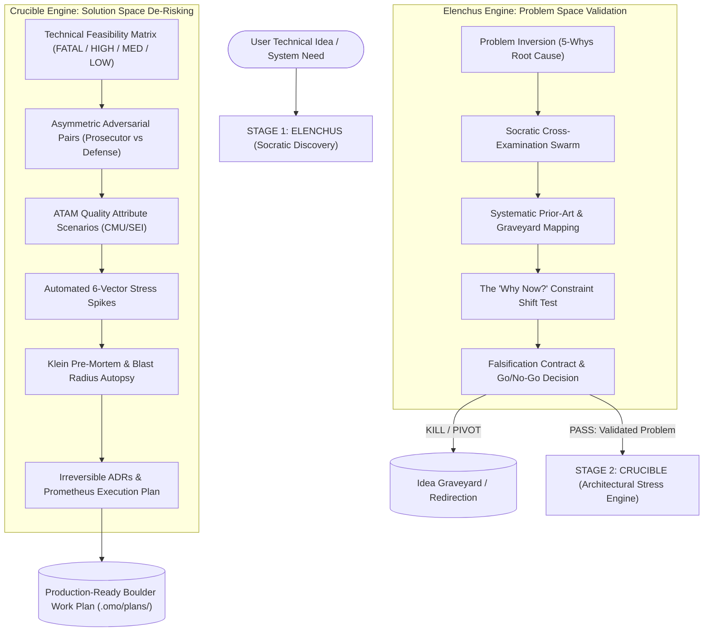

# Elenchus & Crucible Architecture

> Theoretical foundation, subagent orchestration model, and cognitive defense systems for pre-build technical discovery and architectural stress-testing.

---

## 1. Executive Summary

Most software projects fail before the first line of production code is written. In traditional engineering, this manifests as **Requirements Debt** (Standish Group CHAOS studies, Eveleens & Verhoef critiques), unvalidated non-functional constraints, and premature optimization. In AI-assisted software engineering, this failure is magnified tenfold by **Agent Cognitive Failure Modes**:

1. **Epistemic Sycophancy (85.5% default bias)**: LLM agents inherently seek to agree with user prompts, validating half-baked ideas and finding confirmation rather than failure points.
2. **Context Window Degradation & "Lost in the Middle"**: Ingesting massive raw documentation dumps into active agent context rots reasoning quality and induces catastrophic constraint amnesia.
3. **The "Status Code 0" Spike Fallacy**: AI agents default to 10-line happy-path scripts that verify network connectivity or syntax, declaring complex systems "feasible" without testing throughput, backpressure, latency tails, or edge-case failure modes.

**Elenchus** and **Crucible** form a two-stage pre-build discovery and validation engine designed for [OpenCode](https://opencode.ai) and [Oh My OpenAgent (oMo)](https://github.com/BlackPool25/OmniLearn). They replace superficial planning with Popperian falsification, systematic literature mapping, ATAM architectural tradeoffs, and automated 6-vector stress spikes.

---

## 2. The Two Engine Stages



---

## 3. Stage 1: Elenchus (Socratic Problem Discovery)

Named after the Socratic method of refutation (*elenchus*), this engine interrogates whether the problem is real, non-trivial, and worth solving before any architectural design begins.

### 3.1 Problem Framing & Inversion
Elenchus executes Wieringa's strict separation:
- **Knowledge Questions**: *What is true?* (Observed behavior, hardware limits, empirical data).
- **Design Problems**: *What should we build?* (Artifacts, interfaces, workflows).

Treating a design problem as a knowledge question results in confirmation bias. Elenchus forces users through an inverted interrogation:
- *What breaks if this is never built?*
- *Who is currently suffering from this problem, and what workarounds are they using today?*
- *Why is the existing standard tool inadequate?*

### 3.2 Prior-Art & Graveyard Analysis
Elenchus surveys prior art using Kitchenham-light systematic mapping:
- **The Graveyard Sweep**: Actively hunts down deprecated repositories, abandoned startups, and postmortems in the target domain.
- **The "Why Now?" Test**: Identifies the fundamental constraint shift (e.g., SIMD in WebAssembly, hardware-accelerated attention, NVMe-oF bandwidth, zero-copy kernel bypass) that makes this feasible today when others failed.

---

## 4. Stage 2: Crucible (Architectural Stress-Testing)

Crucible transitions from *why* to *how*. It treats proposed technical designs as hypotheses that must be attacked from multiple orthogonal vectors.

### 4.1 Asymmetric Adversarial Pairs
To eliminate the 85.5% LLM sycophancy trap, Crucible deploys independent subagent pairs:
- **The Prosecutor Subagent**: Given the explicit incentive to break the design. It searches for outage reports, memory leak issues, CVEs, scale ceilings, and thread contention bottlenecks.
- **The Defense Subagent**: Tasked with identifying verified architectural mitigations, RFC patterns, and empirical benchmarks.
- **The Arbiter (Lead Agent)**: Evaluates claims strictly on verifiable evidence.

### 4.2 ATAM Quality Attribute Trees
Adopting the CMU/SEI Architecture Tradeoff Analysis Method (ATAM), Crucible translates fuzzy requirements ("fast", "scalable") into rigorous stimulus-response scenarios:

$$\text{Scenario} = \langle \text{Source}, \text{Stimulus}, \text{Artifact}, \text{Environment}, \text{Response}, \text{Response Measure} \rangle$$

Example:
$$\langle \text{10,000 concurrent clients}, \text{WebSocket disconnect burst}, \text{Connection Pool}, \text{Peak Load}, \text{Graceful backpressure}, \text{p99 latency } < 15\text{ms, 0 OOM drops} \rangle$$

### 4.3 The 6-Vector Stress Spike Engine
Crucible rejects superficial spikes. Any spike script must test across at least one of the 6 stress vectors:

| Vector | Stress Mechanism | Failure Signal |
|---|---|---|
| **1. Boundary** | Extreme payload sizing, zero-length tokens, boundary integers | Panic, buffer truncation |
| **2. Concurrency** | Race condition simulation, lock contention, goroutine leaks | Deadlock, data race detected |
| **3. Latency & Tail** | p99/p99.9 latency under queue saturation | Cascading timeout, head-of-line blocking |
| **4. Failure Injection** | Sudden socket closes, dropped packets, disk write-failure | Unhandled exception, state corruption |
| **5. Dependency** | Upstream throttling, 429 rate-limiting, transient 503s | Thundering herd, retry storm |
| **6. Economic / Cost** | TTFT, token burn per request, memory footprint at scale | Exponential cost growth, RAM exhaustion |

---

## 5. 3-Tier Cognitive Memory Architecture

To prevent context bloat and reasoning decay across long sessions, Elenchus & Crucible implement a strict 3-tier memory model:

```
┌─────────────────────────────────────────────────────────────┐
│ Tier 0: Executive State (Active LLM Context Window)         │
│ • Bounded to < 80 lines                                     │
│ • Active hypothesis, current phase, critical constraints    │
└──────────────────────────────┬──────────────────────────────┘
                               │ distilled updates
┌──────────────────────────────▼──────────────────────────────┐
│ Tier 1: Corroborated Evidence Ledger (Disk Markdown Files)  │
│ • .crucible/evidence-ledger.md                              │
│ • Provenance-tagged claims: [CONFIRMED | FALSIFIED | OPEN]  │
│ • GRADE-scored empirical citations                          │
└──────────────────────────────┬──────────────────────────────┘
                               │ raw research output
┌──────────────────────────────▼──────────────────────────────┐
│ Tier 2: Ephemeral Worker Scratchpad (Discarded / Purged)    │
│ • Raw arXiv PDFs, curl responses, terminal spike traces     │
│ • NEVER stuffed into executive agent context                │
└─────────────────────────────────────────────────────────────┘
```

---

## 6. Subagent Delegation Model

Crucible leverages [Oh-My-OpenAgent (oMo)](https://github.com/BlackPool25/OmniLearn) for multi-agent execution:

1. **Explore Swarms**: Dispatched in parallel with isolated context windows to scan codebase structure or documentation without polluting parent context.
2. **Librarian Delegates**: Execute `download-paper` and PyMuPDF text extraction to convert dense PDFs into structured summaries.
3. **Spike Workers**: Run sandboxed code spikes, execute load tests, and capture stdout/stderr evidence into Tier 1 files.
4. **Lead Synthesizer**: Ingests only distilled Tier 1 findings to produce the final Architecture Decision Record (ADR) and Prometheus work plan.
